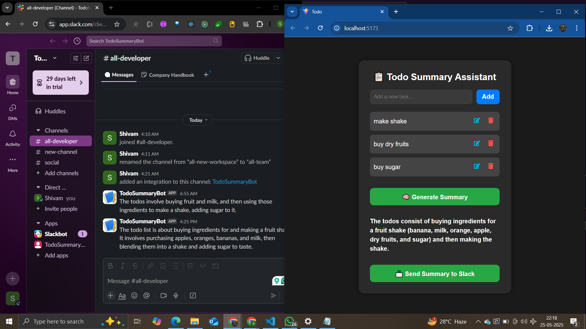
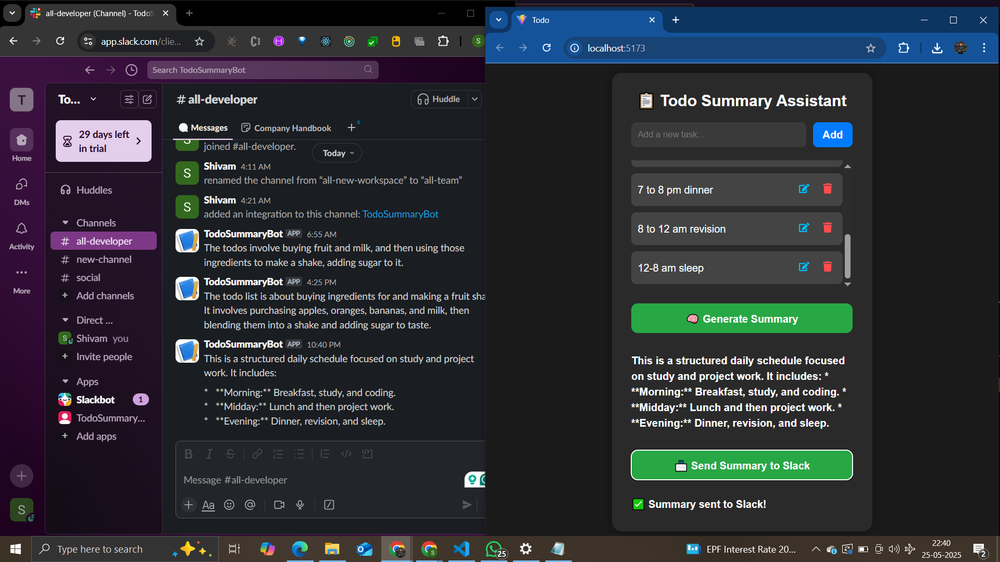

# 📝 Todo Summary Assistant

A full-stack application to manage personal to-do items, summarize pending tasks using an LLM (Google Generative AI via Gemini API), and send the summary to a Slack channel.

---

## 🚀 Features

- ✅ Add, edit, and delete personal to-do items.
- ✅ View the list of all current todos.
- ✅ Summarize pending todos using a real LLM.
- ✅ Send the summary to a Slack channel via Incoming Webhooks.
- ✅ Real-time feedback and clear status messages on success/failure.

---

## 🛠️ Tech Stack

| Layer       | Technology                    |
|-------------|-------------------------------|
| Frontend    | React + Vite                  |
| Backend     | Node.js + Express             |
| LLM         | Google Generative AI (Gemini) |
| Messaging   | Slack Incoming Webhook        |
| Database    | Supabase (PostgreSQL)         |
| Hosting     | Render (frontend)             |

---

## 📦 Project Structure

```
.
├── frontend/                    # React frontend
│   ├── App.jsx
│   ├── App.css
│   ├── main.jsx
│   └── .env
├── backend/
│   ├── index.js                # Entry point: app setup and server start
│   ├── routes
│   │   └── todos.js            # Todos API routes
│   ├── services
│   │   ├── supabaseClient.js  # Supabase client init
│   │   └── googleAI.js        # Google AI helper
│   ├── controllers
│   │   └── todoController.js  # Handlers for todos routes
│   ├── middleware
│   │   └── errorHandler.js    # Error handling middleware
│   └── .env
```

---

## 🧪 Live Demo (Optional)

> 🌐 [Website](https://todo-ai-assistant-2.onrender.com/)

---

## 🔧 Setup Instructions

### 1. Clone the Repository

```bash
git clone https://github.com/ShivamIsHere/todo-summary-assistant.git
cd todo-summary-assistant
```

### 2. Configure Environment Variables

#### ✅ Backend (`backend/.env`)

```env
PORT=3001
SUPABASE_URL=your_supabase_url
SUPABASE_KEY=your_supabase_anon_key
GOOGLE_API_KEY=your_google_generative_ai_key
SLACK_WEBHOOK_URL=https://hooks.slack.com/services/...
```

#### ✅ Frontend (`frontend/.env`)

```env
VITE_REACT_APP_API_URL=http://localhost:3001
```

### 3. Install Dependencies

#### Backend

```bash
cd backend
npm install
```

#### Frontend

```bash
cd ../frontend
npm install
```

### 4. Run the App

#### Backend (Port 3001)

```bash
cd backend
npm run dev
```

#### Frontend (Port 5173)

```bash
cd ../frontend
npm run dev
```

---

## ✨ Slack Integration Setup

1. Go to [https://api.slack.com/messaging/webhooks](https://api.slack.com/messaging/webhooks)
2. Create a new **Incoming Webhook** and select your workspace + channel.
3. Copy the **Webhook URL** and set it in `.env` as `SLACK_WEBHOOK_URL`.

Test manually:

```bash
curl -X POST -H 'Content-type: application/json' \
--data '{"text":"Test message from Todo Summary Assistant"}' \
https://hooks.slack.com/services/xxx/yyy/zzz
```

---

## 🤖 LLM Integration (Google Gemini)

1. Go to [https://makersuite.google.com/app/apikey](https://makersuite.google.com/app/apikey)
2. Generate your **API Key**.
3. Set it as `GEMINI_API_KEY` in the backend `.env`.

> The summary uses Gemini's `text-generative` model to summarize pending todos meaningfully.

---

## 🗃️ Supabase Setup

1. Go to [https://supabase.com](https://supabase.com)
2. Create a project and a `todos` table:

```sql
create table todos (
  id uuid primary key default uuid_generate_v4(),
  title text not null,
  created_at timestamp with time zone default now()
);
```

3. Enable Row Level Security (RLS) and set up anonymous key access.
4. Set your project URL and anon key in `backend/.env`.

---

## 📌 API Endpoints

| Method | Endpoint            | Description                  |
|--------|---------------------|------------------------------|
| GET    | `/todos`            | Fetch all todos              |
| POST   | `/todos`            | Add a new todo               |
| DELETE | `/todos/:id`        | Delete a todo by ID          |
| POST   | `/todos/summarize`  | Summarize and send to Slack  |

---

## 📷 Screenshots

- 
- 

Add your own:

- ✅ Todo List UI  
- 🧠 Summary Display  
- 📨 Slack message in action

---

## 📄 Design & Architecture Notes

- The backend is modular with a clean separation of concerns: LLM and Slack are handled via dedicated services.
- The frontend provides instant feedback and clean minimal UI/UX.
- Slack integration and LLM summaries are fully **real**, not mocked.

---

## 📃 License

**MIT** — free to use for educational and non-commercial purposes.
